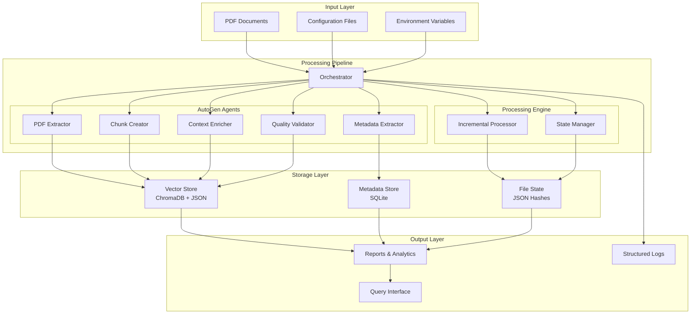

# 🏗️ Architecture Documentation - SharePoint RAG Pipeline

**Detaillierte technische Systemarchitektur für Entwickler und DevOps**

## 🎯 Design Principles

### Core Philosophies
- **Fault Tolerance**: Jede Komponente hat Fallback-Modi
- **Modularity**: Agenten können unabhängig arbeiten
- **Scalability**: Horizontale und vertikale Skalierung
- **Observability**: Vollständiges Logging und Monitoring
- **Security**: Lokale Verarbeitung, keine externe API-Abhängigkeiten
- **Containerization**: Docker-first für maximale Portabilität

### Quality Gates
- **Incremental Processing**: Hash-basierte Änderungserkennung
- **Multi-Backend Resilience**: Automatische PDF-Backend-Auswahl  
- **Rich Context**: Hierarchische, navigationale und semantische Anreicherung
- **Quality Validation**: 7-stufige Qualitätsbewertung pro Chunk

---

## 🏛️ High-Level Architecture



---

## 🔧 Component Architecture

### 1. Orchestrator (`src/pipeline/orchestrator.py`)

**Role**: Central coordination and workflow management

```python
class ContextualRAGOrchestrator:
    """
    Main pipeline coordinator with agent management
    """
    
    def __init__(self):
        self.agents = {
            'pdf_extractor': PDFExtractorAgent(),
            'metadata_extractor': MetadataExtractorAgent(),
            'chunk_creator': ChunkCreatorAgent(),
            'context_enricher': ContextEnricherAgent(),
            'quality_validator': QualityValidatorAgent()
        }
        self.incremental_processor = IncrementalProcessor()
        self.vector_store = VectorStore()
        self.metadata_store = MetadataStore()
```

**Key Features**:
- Thread-pool based parallel processing
- Agent lifecycle management
- Error handling and retry logic
- Progress tracking and reporting
- Resource management

**Responsibilities**:
- Workflow orchestration
- Agent coordination
- State management
- Error recovery
- Performance monitoring

### 2. AutoGen Agent System

#### PDF Extractor Agent (`src/agents/pdf_extractor.py`)

**Multi-Backend Strategy**:
```python
EXTRACTION_BACKENDS = [
    ("PyMuPDF", self._extract_with_pymupdf),
    ("pdfplumber", self._extract_with_pdfplumber), 
    ("PyPDF2", self._extract_with_pypdf2),
    ("OCR", self._extract_with_ocr)  # Fallback
]
```

**Capabilities**:
- Text extraction with layout preservation
- Image and table detection
- OCR for scanned documents
- Metadata extraction (author, title, creation date)

#### Metadata Extractor Agent (`src/agents/metadata_extractor.py`)

**Extraction Pipeline**:
1. **File-level metadata**: Size, timestamps, path info
2. **PDF metadata**: Author, title, subject, creator, keywords
3. **Content analysis**: Language detection, document type classification
4. **Structure analysis**: Page count, table of contents detection

#### Chunk Creator Agent (`src/agents/chunk_creator.py`)

**Contextual Chunking Strategy**:
```python
class ChunkingStrategy:
    SEMANTIC_BOUNDARIES = [
        "\\n\\n",           # Paragraph breaks
        "\\n# ",           # Headers
        "\\n## ",          # Sub-headers
        "\\n\\d+\\.",      # Numbered lists
        "\\n- ",           # Bullet points
        "\\n\\[",          # References
    ]
```

**Features**:
- Hierarchy-aware segmentation
- Configurable chunk size and overlap
- Semantic boundary detection
- Token counting and optimization

#### Context Enricher Agent (`src/agents/context_enricher.py`)

**Context Layers**:

1. **Document Context**:
   ```python
   class DocumentContext:
       title: str
       author: List[str]
       document_type: str
       language: str
       creation_date: Optional[datetime]
   ```

2. **Hierarchical Context**:
   ```python
   class HierarchicalContext:
       chapter: Optional[str]
       section: Optional[str]
       subsection: Optional[str]
       depth_level: int
   ```

3. **Navigational Context**:
   ```python
   class NavigationalContext:
       previous_chunk_id: Optional[str]
       next_chunk_id: Optional[str]
       related_chunks: List[str]
       page_numbers: List[int]
   ```

4. **Content Context**:
   ```python
   class ContentContext:
       semantic_role: SemanticRole
       key_concepts: List[str]
       entities: List[str]
       summary: Optional[str]
   ```

#### Quality Validator Agent (`src/agents/quality_validator.py`)

**7-Stage Quality Assessment**:

1. **Content Completeness** (0-100): Text extraction completeness
2. **Structural Coherence** (0-100): Logical structure preservation
3. **Information Density** (0-100): Meaningful content ratio
4. **Context Richness** (0-100): Metadata completeness
5. **Language Quality** (0-100): Text readability and correctness
6. **Technical Accuracy** (0-100): Format-specific validation
7. **Semantic Consistency** (0-100): Content coherence across chunks

```python
def validate_chunk(self, chunk: ContextualChunk) -> QualityReport:
    scores = {
        'completeness': self._check_completeness(chunk),
        'coherence': self._check_coherence(chunk),
        'density': self._check_information_density(chunk),
        'context_richness': self._check_context_richness(chunk),
        'language_quality': self._check_language_quality(chunk),
        'technical_accuracy': self._check_technical_accuracy(chunk),
        'semantic_consistency': self._check_semantic_consistency(chunk)
    }
    return QualityReport(scores=scores, overall_score=np.mean(list(scores.values())))
```

### 3. Storage Architecture

#### Vector Store (`src/storage/vector_store.py`)

**Dual-Mode Architecture**:
```python
class VectorStore:
    def __init__(self):
        self.primary_backend = ChromaDBBackend()
        self.fallback_backend = JSONFallbackBackend()
        self.active_backend = self._select_backend()
```

**ChromaDB Integration**:
- Collection management per document type
- Rich metadata storage with vectors
- Similarity search optimization
- Persistent storage configuration

**JSON Fallback Mode**:
- File-based vector storage
- Metadata preservation
- Manual similarity search implementation
- Zero-dependency operation

#### Metadata Store (`src/storage/metadata_store.py`)

**SQLite Schema**:
```sql
-- Documents table
CREATE TABLE documents (
    id TEXT PRIMARY KEY,
    file_path TEXT UNIQUE,
    file_hash TEXT,
    title TEXT,
    author TEXT,
    document_type TEXT,
    language TEXT,
    creation_date TIMESTAMP,
    processing_date TIMESTAMP,
    page_count INTEGER,
    chunk_count INTEGER
);

-- Chunks table
CREATE TABLE chunks (
    id TEXT PRIMARY KEY,
    document_id TEXT,
    content TEXT,
    token_count INTEGER,
    char_count INTEGER,
    page_numbers TEXT,  -- JSON array
    position_in_document REAL,
    chunk_type TEXT,
    semantic_role TEXT,
    quality_score REAL,
    context_data TEXT,  -- JSON
    FOREIGN KEY (document_id) REFERENCES documents (id)
);

-- Processing state
CREATE TABLE processing_state (
    file_path TEXT PRIMARY KEY,
    file_hash TEXT,
    last_processed TIMESTAMP,
    processing_status TEXT,
    error_message TEXT
);
```

### 4. Incremental Processing System

#### State Management (`src/pipeline/incremental_processor.py`)

**Hash-based Change Detection**:
```python
class IncrementalProcessor:
    def __init__(self):
        self.state_file = "data/state/file_hashes.json"
        self.file_hashes = self._load_state()
    
    def get_files_to_process(self, input_dir: Path) -> List[Path]:
        """Identify new or changed files"""
        new_files = []
        for pdf_file in input_dir.glob("**/*.pdf"):
            current_hash = self._calculate_file_hash(pdf_file)
            stored_hash = self.file_hashes.get(str(pdf_file))
            
            if current_hash != stored_hash:
                new_files.append(pdf_file)
        
        return new_files
```

**Cleanup Management**:
- Orphaned document detection
- Vector store cleanup
- Metadata consistency maintenance
- State synchronization

---

## 🐳 Container Architecture

### Multi-Stage Docker Build

```dockerfile
# Stage 1: Base dependencies
FROM python:3.11-slim as base
RUN apt-get update && apt-get install -y \
    tesseract-ocr \
    tesseract-ocr-deu \
    poppler-utils \
    && rm -rf /var/lib/apt/lists/*

# Stage 2: Python dependencies
FROM base as python-deps
COPY requirements.txt .
RUN pip install --no-cache-dir -r requirements.txt

# Stage 3: Production
FROM python-deps as production
WORKDIR /app
COPY . .
USER 1000:1000
CMD ["python", "run_pipeline.py"]

# Stage 4: Development
FROM production as development
USER root
RUN pip install jupyter pytest black flake8
USER 1000:1000
```

### Service Architecture (docker-compose.yml)

```yaml
services:
  # Core pipeline service
  rag-pipeline:
    build: .
    target: production
    volumes:
      - "${INPUT_DIR:-./test_data}:/app/input:ro"
      - "rag_data:/app/data"
      - "rag_logs:/app/logs"
    environment:
      - MAX_WORKERS=${MAX_WORKERS:-4}
      - MIN_QUALITY_SCORE=${MIN_QUALITY_SCORE:-70}
    
  # Scheduled processing
  rag-scheduler:
    extends: rag-pipeline
    command: ["python", "scheduler.py"]
    profiles: ["scheduled"]
    
  # Development environment
  rag-dev:
    extends: rag-pipeline
    target: development
    command: ["tail", "-f", "/dev/null"]
    profiles: ["dev"]
    
  # External ChromaDB
  chromadb:
    image: chromadb/chroma:latest
    ports: ["8000:8000"]
    volumes: ["chroma_data:/chroma/chroma"]
    profiles: ["external-db"]
    
  # Log monitoring
  log-viewer:
    image: gohttpserver/gohttpserver
    command: ["--root=/logs", "--port=8080"]
    volumes: ["rag_logs:/logs:ro"]
    ports: ["8080:8080"]
    profiles: ["monitoring"]
```

---

## 🔄 Data Flow Architecture

### Processing Pipeline Flow

```
[PDF Input] 
    ↓
[File Discovery & Incremental Check]
    ↓
[PDF Extraction] → [Metadata Extraction]
    ↓                      ↓
[Content Chunking] ← [Hierarchical Analysis]
    ↓
[Context Enrichment]
    ↓ 
[Quality Validation]
    ↓
[Vector Embedding] → [Storage Persistence]
    ↓                      ↓
[Report Generation] ← [State Update]
```

### Data Models

#### Contextual Chunk Model
```python
@dataclass
class ContextualChunk:
    # Identity
    chunk_id: str
    content: str
    
    # Metrics
    token_count: int
    char_count: int
    page_numbers: List[int]
    position_in_document: float
    
    # Context layers
    document_context: DocumentContext
    hierarchical_context: HierarchicalContext
    navigational_context: NavigationalContext
    content_context: ContentContext
    
    # Quality
    quality_score: float
    validation_details: QualityReport
    
    # Processing metadata
    chunk_type: ChunkType
    processing_timestamp: datetime
    vector_embedding: Optional[List[float]]
```

#### Processing State Model
```python
@dataclass
class ProcessingState:
    file_path: str
    file_hash: str
    last_processed: datetime
    processing_status: ProcessingStatus
    chunk_count: int
    quality_summary: QualityDistribution
    error_details: Optional[str]
```

---

## 🔧 Extension Points

### Adding New Agents

```python
# 1. Inherit from BaseAgent
class CustomAgent(BaseAgent):
    def __init__(self, config: Dict[str, Any]):
        super().__init__(config)
        
    def process(self, context: ProcessingContext) -> AgentResult:
        # Custom processing logic
        pass

# 2. Register with orchestrator
orchestrator.register_agent('custom_agent', CustomAgent(config))

# 3. Add to pipeline workflow
orchestrator.add_processing_step('custom_processing', ['custom_agent'])
```

### Custom Storage Backends

```python
class CustomVectorStore(VectorStoreInterface):
    def store_vectors(self, chunks: List[ContextualChunk]) -> bool:
        # Custom storage implementation
        pass
        
    def query_similar(self, query: str, limit: int) -> List[SimilarityResult]:
        # Custom query implementation
        pass
```

### Plugin Architecture

```python
# plugins/custom_enricher.py
class CustomContextEnricher(PluginInterface):
    def enrich_context(self, chunk: ContextualChunk) -> ContextualChunk:
        # Custom enrichment logic
        return enhanced_chunk

# Register plugin
plugin_manager.register_plugin('custom_enricher', CustomContextEnricher())
```

---

## 📊 Performance Architecture

### Scalability Patterns

#### Horizontal Scaling
```yaml
# Kubernetes deployment
apiVersion: apps/v1
kind: Deployment
spec:
  replicas: 5  # Multiple pipeline instances
  strategy:
    type: RollingUpdate
    rollingUpdate:
      maxSurge: 1
      maxUnavailable: 0
```

#### Vertical Scaling
```yaml
# Resource limits per container
resources:
  requests:
    memory: "2Gi"
    cpu: "1"
  limits:
    memory: "8Gi"
    cpu: "4"
```

### Performance Monitoring

```python
class PerformanceMonitor:
    def __init__(self):
        self.metrics = {
            'processing_time_per_document': [],
            'memory_usage_peak': [],
            'chunks_per_second': [],
            'quality_score_distribution': [],
            'error_rate': 0.0
        }
    
    def track_processing(self, start_time: float, end_time: float, 
                        document_size: int, chunk_count: int):
        processing_time = end_time - start_time
        self.metrics['processing_time_per_document'].append(processing_time)
        self.metrics['chunks_per_second'].append(chunk_count / processing_time)
```

---

## 🔒 Security Architecture

### Container Security
- Non-root user execution (UID 1000)
- Read-only input mounts
- Resource limits and quotas
- Network isolation capabilities
- Secrets management via environment variables

### Data Security
- Local processing (no external API calls)
- Encrypted data at rest (configurable)
- Audit logging for all operations
- Input validation and sanitization
- Output data anonymization options

### Access Control
```python
class SecurityManager:
    def validate_input_path(self, path: str) -> bool:
        """Prevent path traversal attacks"""
        return not (".." in path or path.startswith("/"))
    
    def sanitize_content(self, content: str) -> str:
        """Remove potential security risks from content"""
        return content  # Implementation depends on requirements
```

---

## 🔍 Observability Architecture

### Logging Strategy
```python
import structlog

logger = structlog.get_logger("contextual_rag")

# Structured logging with context
logger.info(
    "document_processed",
    document_id=doc_id,
    chunk_count=len(chunks),
    processing_time=end_time - start_time,
    quality_score=avg_quality,
    agent_performance={
        'pdf_extraction': extraction_time,
        'chunking': chunking_time,
        'enrichment': enrichment_time
    }
)
```

### Metrics Collection
- Processing throughput (docs/minute)
- Quality score distribution
- Memory and CPU utilization
- Error rates by component
- Storage utilization trends

### Health Checks
```python
class HealthChecker:
    def check_system_health(self) -> HealthStatus:
        checks = {
            'storage_accessible': self._check_storage(),
            'memory_available': self._check_memory(),
            'agent_responsive': self._check_agents(),
            'config_valid': self._check_config()
        }
        return HealthStatus(checks)
```

---

## 🚀 Deployment Architectures

### Local Development
- Docker Compose with hot-reload
- Jupyter notebook integration
- Debug mode with detailed logging
- Test data generators

### Production Single-Node
- Docker Compose with restart policies
- Volume persistence
- Log rotation
- Automated backups

### Production Multi-Node
- Kubernetes deployment
- Shared storage (NFS/GlusterFS)
- Load balancing
- High availability

### Cloud-Native
- Container registry integration
- CI/CD pipelines
- Monitoring and alerting
- Auto-scaling based on workload

---

## 📈 Future Architecture Considerations

### Planned Enhancements
1. **Microservices Split**: Separate services per agent type
2. **Message Queue Integration**: Asynchronous processing with Redis/RabbitMQ
3. **GPU Acceleration**: CUDA support for embedding generation
4. **Multi-Language Support**: Additional language models and OCR engines
5. **Real-time Processing**: WebSocket API for live document processing
6. **Analytics Dashboard**: Web UI for monitoring and configuration

### Scalability Roadmap
- **Phase 1**: Current architecture (single-node, multi-thread)
- **Phase 2**: Multi-node with shared storage
- **Phase 3**: Microservices with message queues
- **Phase 4**: Cloud-native with auto-scaling

This architecture provides a solid foundation for a production-ready contextual RAG pipeline while maintaining flexibility for future enhancements and scale requirements.